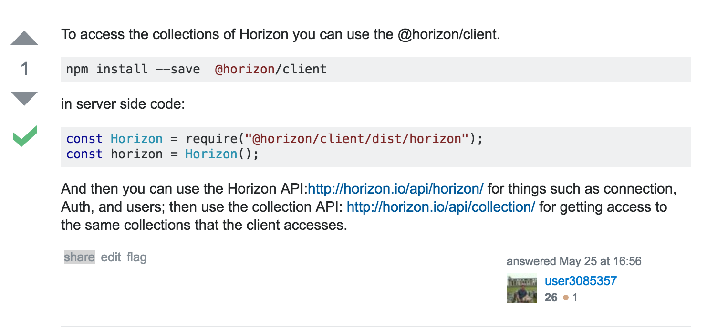

# horizon client in node

```
date: Mon Jun 27 2016 14:13:20 GMT+1000 (AEST)
```

Connecting to [horizon](http://horizon.io/) from nodejs.

## tl;dr

If you're doing something like this and getting an error:

```
const Horizon = require('@horizon/client')
const horizon = Horizon();
```

just wait for the next version of `@horizon/client` to be published (`1.1.3` at the time of writing).

If you want to patch in the meantime, remove `require('imports?this=>global!exports?global.fetch!isomorphic-fetch');` from `node_modules/@horizon/client/lib/util/fetch.js`

## notes

I observed that using `require('@horizon/client)` resulted in an error: `Error: Cannot find module 'imports?this=>global!exports?global.fetch!isomorphic-fetch'`

There are a few places on the internet suggesting similar to this:

[](http://stackoverflow.com/a/37443381/904062)

But when I tried `require('@horizon/client/dist/horizon')` instead, it didn't seem to work: no error message, but the script failed silently. Not even seeing `horizon.onReady` firing.

After removing `require('imports?this=>global!exports?global.fetch!isomorphic-fetch');` from `@horizon/client/lib/util/fetch.js` it all works as expected.

Soon after I found that this has [aleady been removed in the `next` branch](https://github.com/rethinkdb/horizon/commit/be83b2236a56272fa741c9f8f9d61c2bd86fa0b4#diff-f36dea775d6beae0d046d68a4e4424a5L6)
