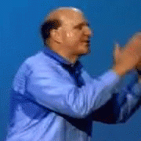

# tech goals for 2017

Some things I want to focus on in 2017:

## components components components components

The web has become component-shaped, and I want to learn how to get the most out of this.

## declarative languages

I want to better understand the elements of good design when it comes to purely declarative languages, and where the strengths & weaknesses are.

## business rules

No matter how well I think I know programming, there's always an unusual business rule from a real-world project that makes me question everything :)

So I want to get better at writing code that doesn't buckle under real-world conditions, and learn the underlying principles at play.
